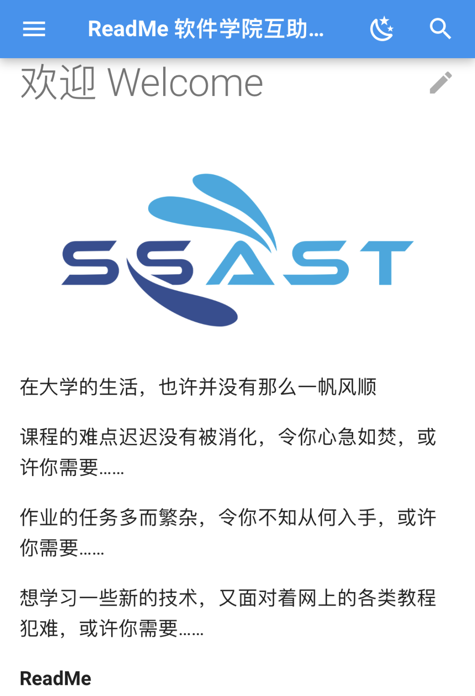

# 技术部

技术部的主要工作是学院内的**信息化建设**与满足院系内外的**开发需求**。

## 日常：技术分享

技术部致力为大家打造一个轻松愉快的分享、学习技术的环境。在通常每两周一次的例会上（当然平时也可以在群里聊），我们都以“**茶话会**”的方式鼓励同学们进行技术分享，聊一聊最近的学习生活中看到的/在学的一些技术，接触到的有用的工具、有趣的知识，亦或是最近的心得、感想、整活，我们全都欢迎。精彩的分享可能会被整理起来，通过专门出期推送等方式发布出去。

## 科协服务器维护

技术部也负责维护科协内部的服务器。本学期，我们向院系的同学开放了[服务器虚拟机的使用权限](https://mp.weixin.qq.com/s/_qkzxvWK0uE3QxumUWPJ6g)，同学们可按照教程获取虚拟机并通过 SSH 连接。

之后可能会继续开放 GPU 计算资源供同学们使用。

## README 互助文档

为了给软院同学们提供**笔记分享、作业攻略和技术分享**的平台，技术部和项目部联合推进了[ReadMe互助文档项目](https://ssast-readme.github.io/)。同学们在分享自己优秀的经验、思考、感悟的同时，能够得到志愿工时与各种奖品作为感谢。

本学期，同学们积极参与，投了数十篇优秀的稿件，ReadMe项目建设初见成效。在 [表彰会](https://mp.weixin.qq.com/s/5MQ5Ndhfh6ctOEbdMHrCiw) 上，我们为作者们颁发了奖品，并就「如何才能更好的激发同学们投稿？」、「在整个过程中，科协有哪些方面需要改善？」两方面进行了讨论，明确了之后改进的方向。

技术部的日常工作包括README网站的维护与审稿。如果你想体验ReadMe的运营工作，亦或想在其他方面为README项目做成贡献，都欢迎加入我们！

## 项目实战

**THUAI**：每年我们都会与校科协一起承办 THUAI（清华大学人工智能挑战赛），并于校科展上展示开发成果和选手们的优秀参赛作品。如果你有着满腔的开发热血，也想把自己所学的知识应用到实践中，开发出“能用、好用、管用”的软件，那么 THUAI 开发绝对是你不容错过的机会！

除此之外，技术部也会为院系内外的各种开发需求提供帮助。在这里，只要你想锻炼自己的能力，总能找到适合你的实战机会！

## 预期收获

在这里，你能够和同学们一起交流**学习新技术**、**提高自己的代码开发、项目运营能力**，学以致用，用自己的技术服务院系内外的同学。

## 招新要求

不必担心自己经验不足，只要**对技术开发感兴趣**，随时欢迎加入我们！如果你有任何天马行空的想法，技术部都可以助力你一起实现。

