title: 软件学院学生科协
speaker: 软件学院学生科协
url: https://www.ssast.net/
css:

   - main.css

<slide class="bg-black-blue aligncenter" image="bg1.jpg .dark.anim">

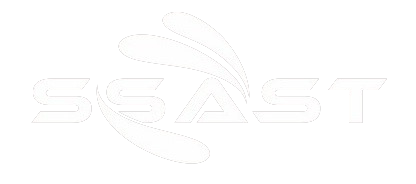{.ghost.animated.flipInX.delay-300}

一个神秘，但不完全神秘的组织 {.text-intro.animated.fadeInUp.delay-500}

[:fa-home: Homepage](https://www.ssast.net/){.button.ghost.animated.flipInX.delay-1200}
[:fa-github: Github](https://github.com/ssast-tech){.button.ghost.animated.flipInX.delay-1200}
[:fa-child: Join Us](https://www.wjx.top/vm/QmaWuSS.aspx){.button.ghost.animated.flipInX.delay-1200}

<slide class="bg-black-blue aligncenter" image="bg1.jpg .dark.anim">

:::column {.vertical-align}

# 我们的目标

---

## 立足技术科创{.ghost.animated.fadeInUp.delay-300}

## 服务全院同学{.ghost.animated.fadeInUp.delay-600}

## 领略科学魅力{.ghost.animated.fadeInUp.delay-900}

## 历练社工技能{.ghost.animated.fadeInUp.delay-1200}

<!-- ## .{.ghost.animated.fadeInUp.delay-900} -->

:::

<slide class="bg-black-blue aligncenter" image="bg1.jpg .dark.anim">

 {.ghost.animated.flipInX.delay-300}

### 四个部门，总有你的专属 {.ghost.animated.flipInX.delay-300}

:::flexblock {.clients}

# 常务部

宣传策划、内联团建、财务管理

{.ghost.animated.fadeInUp.delay-1800}

---

# 技术部

技术开发、技术支持、技术培训

{.ghost.animated.fadeInUp.delay-1200}

---

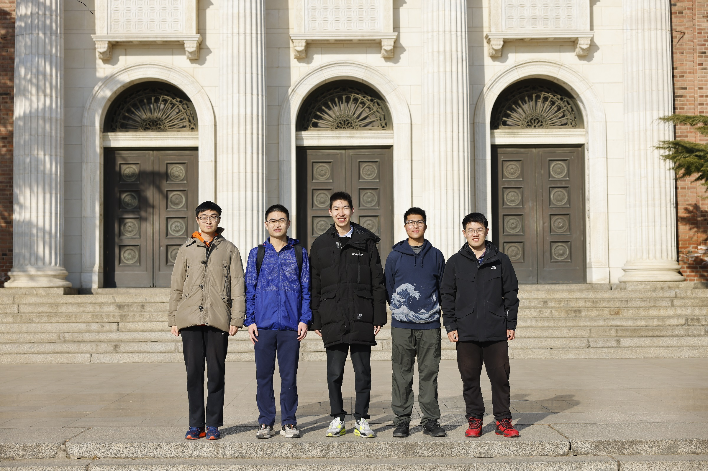

# 赛事部

游戏开发、赛事筹办、机试模拟

{.ghost.animated.fadeInUp.delay-600}

---

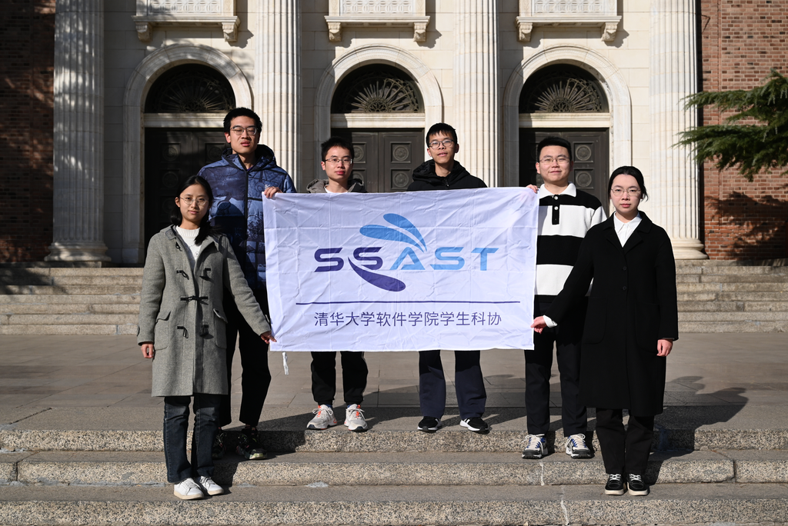

# 项目部

科创项目、挑战杯、SSRT

{.ghost.animated.fadeInUp}

:::

<slide class="bg-apple aligncenter">
:::column {.vertival-align}

{.ghost.animated.flipInX.delay-300}

### {.ghost.animated.fadeInUp.delay-400}

# 常务部

---

## 宣传策划{.ghost.animated.fadeInUp.delay-300}

## 内联团建{.ghost.animated.fadeInUp.delay-600}

## 财务管理{.ghost.animated.fadeInUp.delay-900}

<!-- ## .{.ghost.animated.fadeInUp.delay-900} -->

<slide class="bg-black-blue aligncenter" image="bg1.jpg .dark.anim" :class="size-70">

### **多样的推送内容**

:::column{.aligncenter}
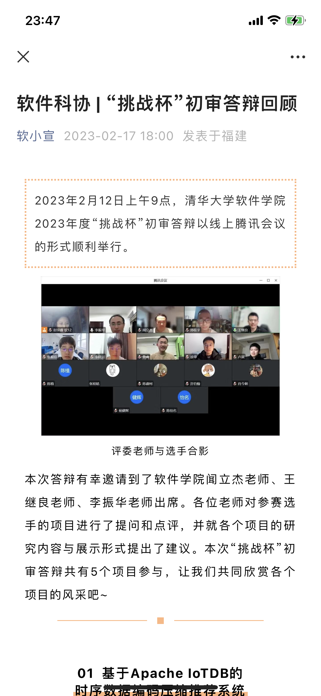

---

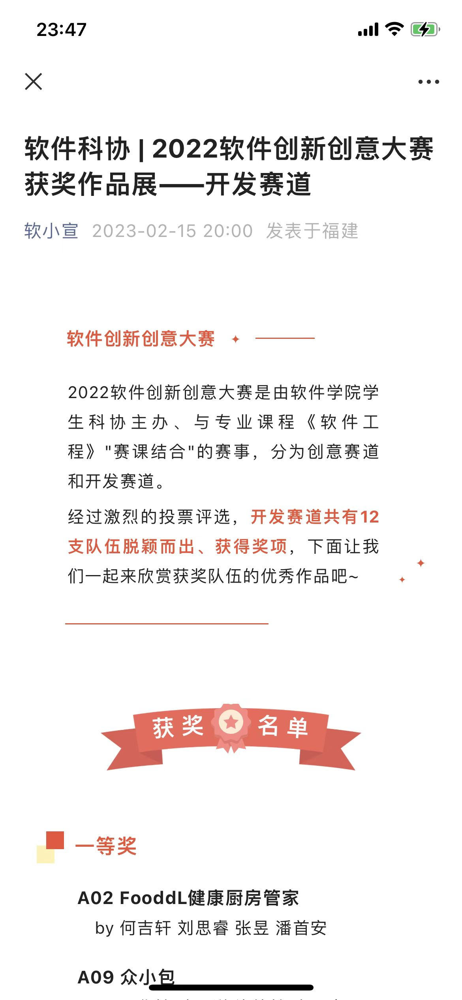

---

---

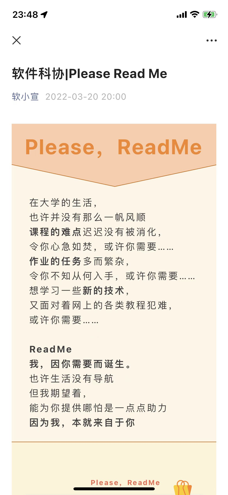

:::

<slide class="bg-black-blue aligncenter" image="bg1.jpg .dark.anim" :class="size-70">

### **多元化的宣传形式**

:::gallery{.aligncenter}

## 推送

---

## 海报

---

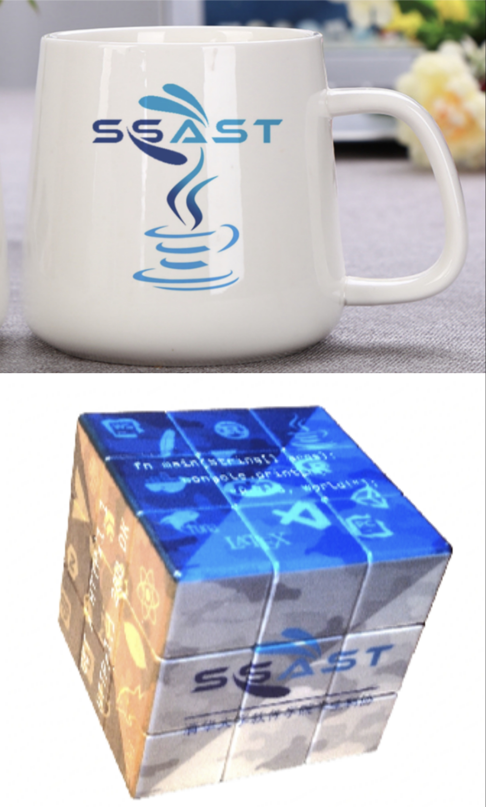

## 实物纪念品

:::

<slide class="bg-black-blue aligncenter" image="bg1.jpg .dark.anim">

## 活动策划与活动室管理{.ghost.animated.fadeInUp.delay-600}

:::flexblock {.clients}

#### 608B

购买墙饰桌椅，管理书籍

{.ghost.animated.fadeInUp.delay-800}

---

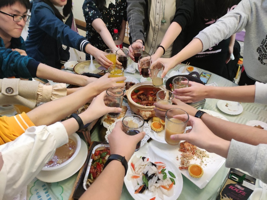

#### 团建活动

筹划科协内部聚餐

{.ghost.animated.fadeInUp.delay-400}

---

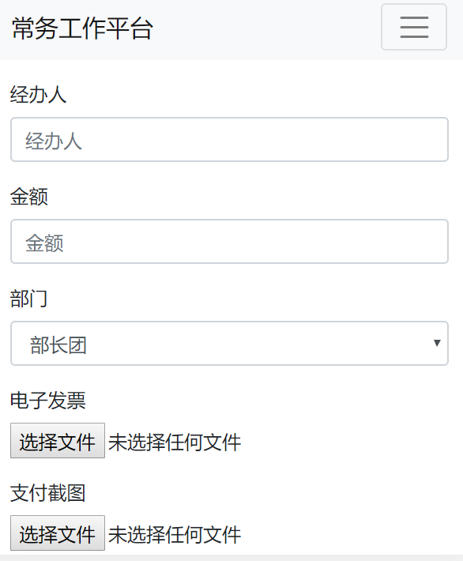

#### 财务管理

线上报销平台

{.ghost.animated.fadeInUp}

:::

<slide class="bg-black-blue aligncenter" image="bg1.jpg .dark.anim">

:::column {.vertical-align}
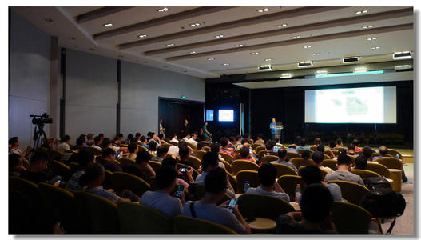{.ghost.animated.flipInX.delay-300}

# 更多计划

---

#### 加强部内联系、丰富团建形式、完善财物管理 {.ghost.animated.fadeInUp.delay-600}

<!-- ## .{.ghost.animated.fadeInUp.delay-900} -->

:::

<slide class="bg-black-blue aligncenter" image="bg1.jpg .dark.anim" :class="size-70">

## 预期收获

---

:::gallery{.aligncenter}

## 培养宣传和策划能力

---

## 零食与团队建设

---

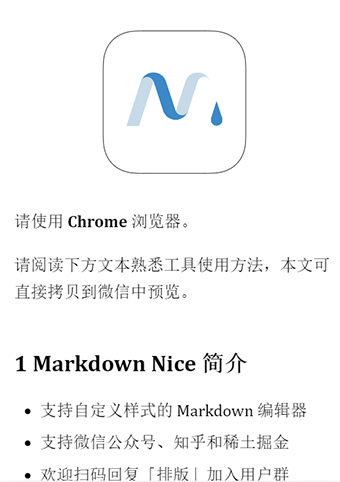

## 学习在线文档

:::

<slide class="bg-black-blue aligncenter" image="bg1.jpg .dark.anim">

:::column {.vertical-align}

## 招收要求

---

#### 愿意参与社会工作{.ghost.animated.fadeInUp.delay-200}

#### 有志学习宣传技能{.ghost.animated.fadeInUp.delay-300}

#### 最重要的是：{.ghost.animated.fadeInUp.delay-400}

### **热情 与 热爱**{.ghost.animated.fadeInUp.delay-400}

<slide class="bg-apple aligncenter">

:::column {.vertical-align}

{.ghost.animated.flipInX.delay-300}

#### {.ghost.animated.fadeInUp.delay-500}

# 技术部

---

## 信息化建设{.ghost.animated.fadeInUp.delay-600}

## 技术开发{.ghost.animated.fadeInUp.delay-900}

## 技术培训{.ghost.animated.fadeInUp.delay-1200}

<slide class="bg-black-blue aligncenter" image="bg1.jpg .dark.anim">

:::column {.vertical-align}

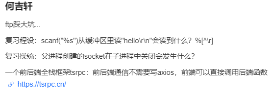

朴 实

---

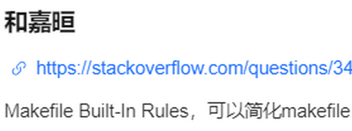

无 华

---

## 日常技术分享{.ghost.animated.fadeInUp}

- 例会上，可以分享最近遇到的一些有趣的技术。{.ghost.animated.fadeInUp.delay-1000}
- 可以是有用的工具，有趣的知识，甚至是整活。{.ghost.animated.fadeInUp.delay-1000}
- 精彩的分享可能会搜集起来专门出期推送。{.ghost.animated.fadeInUp.delay-1000}

:::

<slide class="bg-black-blue aligncenter" image="bg1.jpg .dark.anim">

:::column {.vertical-align}

---

---

## 科协服务器维护{.ghost.animated.fadeInUp}

- 负责维护科协内部的服务器。
- 上学期，向同学们开放了[服务器虚拟机的使用权限](https://mp.weixin.qq.com/s/_qkzxvWK0uE3QxumUWPJ6g)。
- 之后可能会继续开放 GPU 计算资源供同学们使用。

<slide class="bg-black-blue aligncenter" image="bg1.jpg .dark.anim">

## README 互助文档

:::column {.vertical-align}

---

### 笔记分享
### 作业攻略
### 技术分享
- 同学们在分享自己优秀的经验、思考、感悟的同时，能够得到志愿工时与各种奖品作为感谢。

:::
<slide class="bg-black-blue aligncenter" image="bg1.jpg .dark.anim">

## 实战开发{.ghost.animated.fadeInUp}

---

:::gallery{.aligncenter}

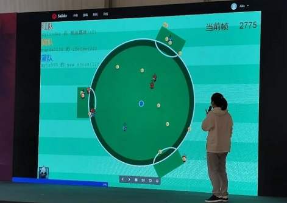

#### THUAI

参与 THUAI 比赛的开发

{.ghost.animated.fadeInUp}

---

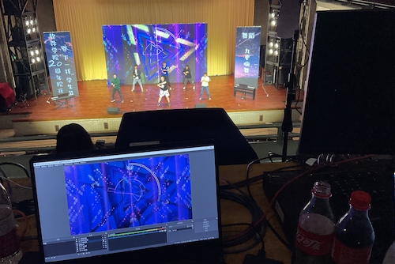

#### 学生节抽奖&弹幕系统

 对接学生会甲方；实战运维学生节弹幕系统

{.ghost.animated.fadeInUp}

:::

<slide class="bg-black-blue aligncenter" image="bg1.jpg .dark.anim">

:::column {.vertical-align}

 {.ghost.animated.fadeInUp}

---

## 暑期培训{.ghost.animated.fadeInUp}

#### 和信息学院其他院系共同进行{.ghost.animated.fadeInUp}

#### 覆盖前后端 .NET 游戏开发 硬件开发 等 {.ghost.animated.fadeInUp.}

#### 迅速提高技术水平 {.ghost.animated.fadeInUp}

<slide class="bg-black-blue aligncenter" image="bg1.jpg .dark.anim">

:::column {.vertical-align}

## 预期收获

---

#### 与同伴共同学习新技术{.ghost.animated.fadeInUp}

#### 在实战中，掌握开发、运营等技能{.ghost.animated.fadeInUp}

#### 提升社工经验，增强沟通协作能力{.ghost.animated.fadeInUp}

<slide class="bg-black-blue aligncenter" image="bg1.jpg .dark.anim">

:::column {.vertical-align}

## 招收要求

---

#### 对技术开发感兴趣{.ghost.animated.fadeInUp}

#### 乐于探索，善于合作{.ghost.animated.fadeInUp}

#### 有技术专长更佳{.ghost.animated.fadeInUp}

<slide class="bg-black-blue aligncenter" image="bg1.jpg .dark.anim">

# 技术部欢迎你的加入！

<!-- ## .{.ghost.animated.fadeInUp.delay-900} -->

<slide class="bg-apple aligncenter">

:::column {.vertical-align}

{.ghost.animated.flipInX.delay-300}

# 赛事部

---

### 策划、组织学生赛事	{.ghost.animated.fadeInUp.delay-600}

### 赛事游戏设计与开发{.ghost.animated.fadeInUp.delay-900}

### 技术学习与交流{.ghost.animated.fadeInUp.delay-1200}

<!-- ## .{.ghost.animated.fadeInUp.delay-900} -->

:::

<slide class="bg-black-blue aligncenter" image="bg1.jpg .dark.anim">

## 赛事部主要工作{.flipInX}

:::flexblock {.blink.border}

#### 保研机试模拟{..bg-blue}

##### 秋季学期

---

#### 软件创新创意大赛 {..bg-primary}

##### 秋季学期

---

#### 新生知识竞赛 {..bg-secondary}

##### 秋季学期

---

#### 图谋{..bg-white}

##### 春季学期

:::

<slide class="bg-black-blue aligncenter" image="bg1.jpg .dark.anim">

### 秋季学期工作{.flipInX}

:::flexblock {.clients}

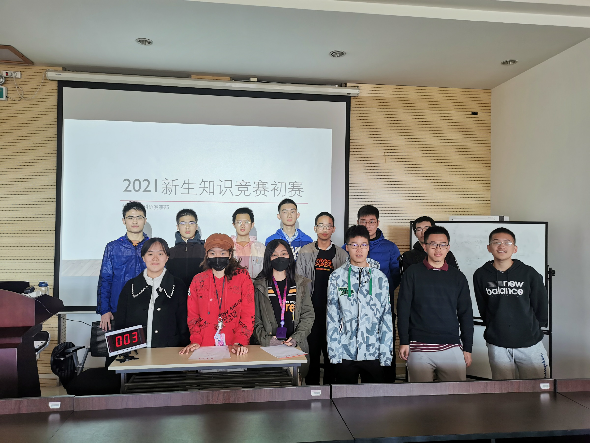

#### 新生知识竞赛

初赛组织、选题

{.ghost.animated.fadeInUp.delay-800}

---

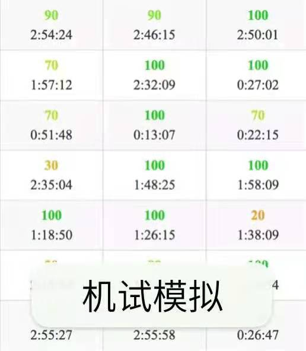

#### 保研机试模拟

宣传、组织、选题

{.ghost.animated.fadeInUp.delay-400}

---

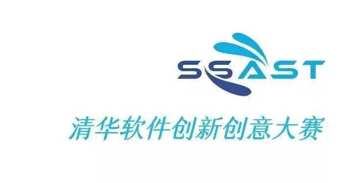

#### 软件创新创意大赛

设计、策划、宣传、运营

{.ghost.animated.fadeInUp.delay}

:::

<slide class="bg-black-blue aligncenter" image="bg1.jpg .dark.anim">

### 图谋 GStrategy{.flipInX}

:::flexblock {.clients}

{.ghost.animated.fadeInUp.delay-400}

---

{.ghost.animated.fadeInUp}

:::

<slide class="bg-black-blue aligncenter" image="bg1.jpg .dark.anim">

## 在赛事部，你可以选择：{.fadeInUp}

---

:::shadowbox

#### 赛事/游戏设计与开发

亲手设计和开发一个有趣的策略游戏，让点子落地！

---

#### 可视化&美工设计

使用各种技术进行设计、绘制，将游戏可视化。

****

#### 赛事运营&推广

策划、组织一场赛事，与赛事相关各方进行沟通和协调；宣传赛事及工作成果与比赛结果的同时吸引更多同学成为潜在选手，推广赛事。

:::

<slide class="bg-black-blue aligncenter" image="bg1.jpg .dark.anim">

****
# 我们是游戏的组织者，更是充满热情和创意的玩家 {.bounceIn}
# 赛事部期待你的加入！{.bounceIn}

<!-- ## .{.ghost.animated.fadeInUp.delay-900} -->

:::

<slide class="bg-apple aligncenter">

:::column {.vertical-align}

{.ghost.animated.flipInX.delay-300}

### {.ghost.animated.fadeInUp.delay-400}

# 项目部

---

## 科创项目{.ghost.animated.fadeInUp.delay-600}

## 科研宣传{.ghost.animated.fadeInUp.delay-900}

## 活动筹办{.ghost.animated.fadeInUp.delay-1200}

<!-- ## .{.ghost.animated.fadeInUp.delay-900} -->

:::

<slide class="bg-black-blue aligncenter" image="bg1.jpg .dark.anim">

# 挑战杯

#### 报名宣传、整理材料、组织初审{.ghost.animated.fadeInUp.delay-300}

#### 参与校级科创比赛筹办全过程{.ghost.animated.fadeInUp.delay-400}

:::flexblock {.clients}

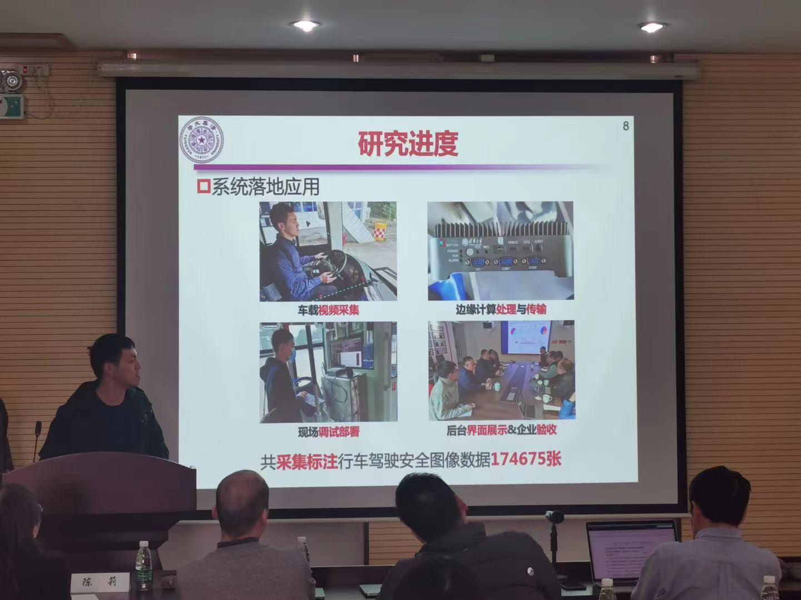

#### 选手在初审现场答辩

{.ghost.animated.delay-900}

---

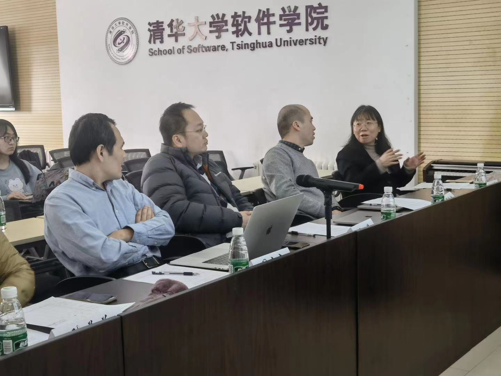

#### 评委老师讨论

{.ghost.animated.delay-600}

---

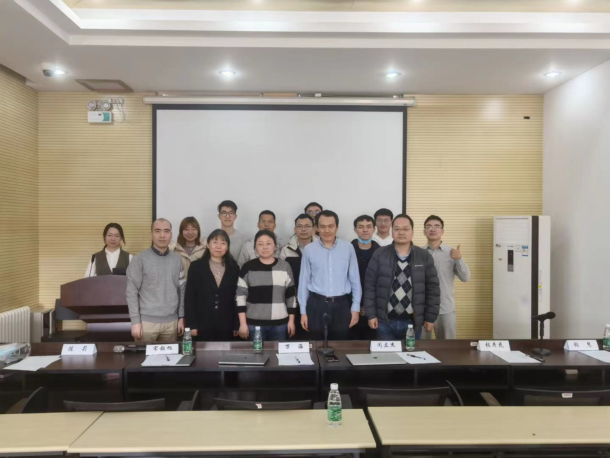

#### 初审合影留念

{.ghost.animated.flipInX}

<!-- ## .{.ghost.animated.fadeInUp.delay-900} -->

:::

<slide class="bg-black-blue aligncenter" image="bg1.jpg .dark.anim">

# 校科展

#### 搭建软件学院科创展位{.ghost.animated.fadeInUp.delay-600}

#### 与校内外大佬愉快交流{.ghost.animated.fadeInUp.delay-900}

:::flexblock {.clients}

#### 作者与工作人员合影

{.ghost.animated.fadeInUp.delay-600}

---

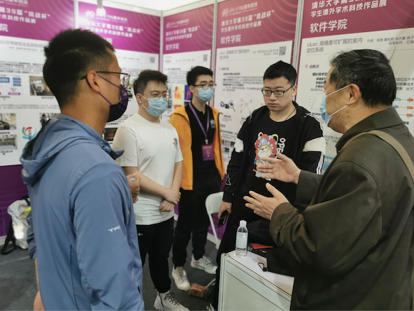

#### 项目作者与来宾交流

{.ghost.animated.fadeInUp.delay-300}

---

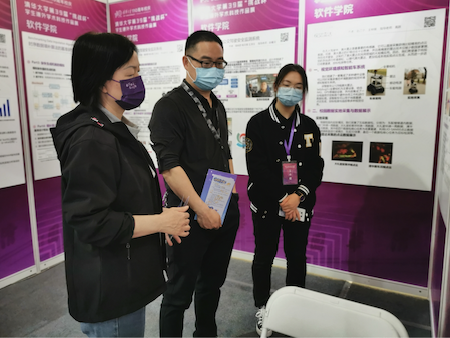

#### 工作人员为来宾讲解

{.ghost.animated.fadeInUp}

<!-- ## .{.ghost.animated.fadeInUp.delay-900} -->

<slide class="bg-black-blue aligncenter" image="bg1.jpg .dark.anim">

:::column {.vertical-align}

# 

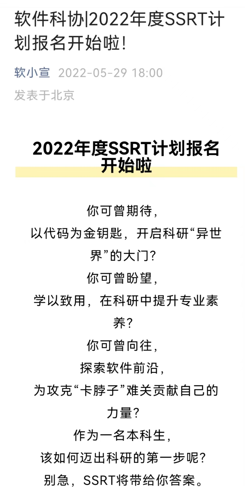{.ghost.animated.fadeInUp.delay-300}

---

### SSRT{.ghost.animated.fadeInUp.delay-300}

#### 院系定制版SRT计划{.ghost.animated.fadeInUp.delay-600}

#### 开放院系科创机会{.ghost.animated.fadeInUp.delay-600}

#### 弘扬本科生科研氛围 {.ghost.animated.fadeInUp.delay-900}

<!-- ## .{.ghost.animated.fadeInUp.delay-900} -->

:::

<slide class="bg-black-blue aligncenter" image="bg1.jpg .dark.anim">

:::column {.vertical-align}

### SSRT中期沙龙{.ghost.animated.flipInX.delay-200}

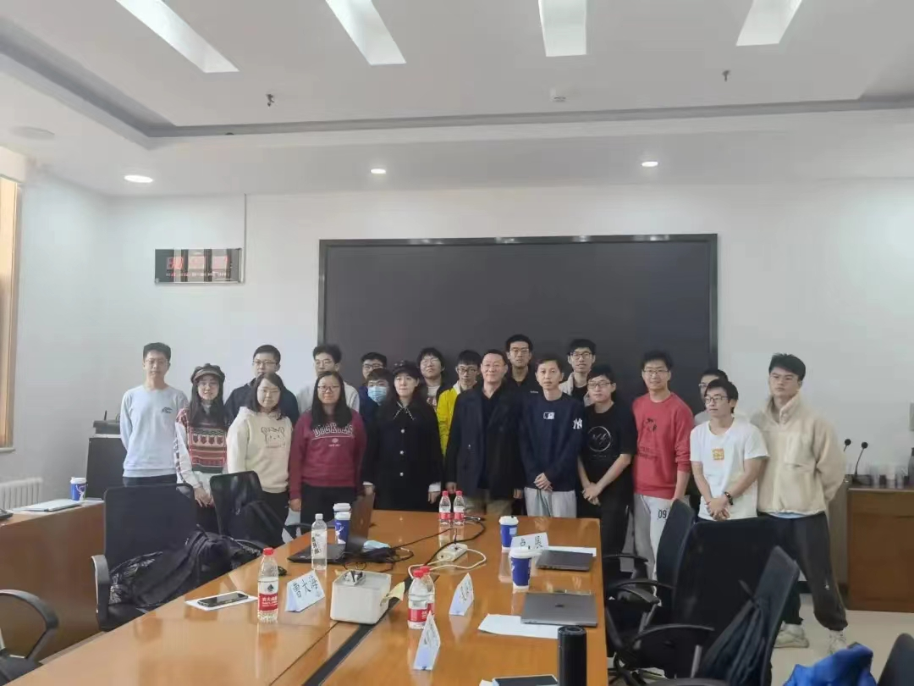{.ghost.animated.flipInX.delay-300}

------

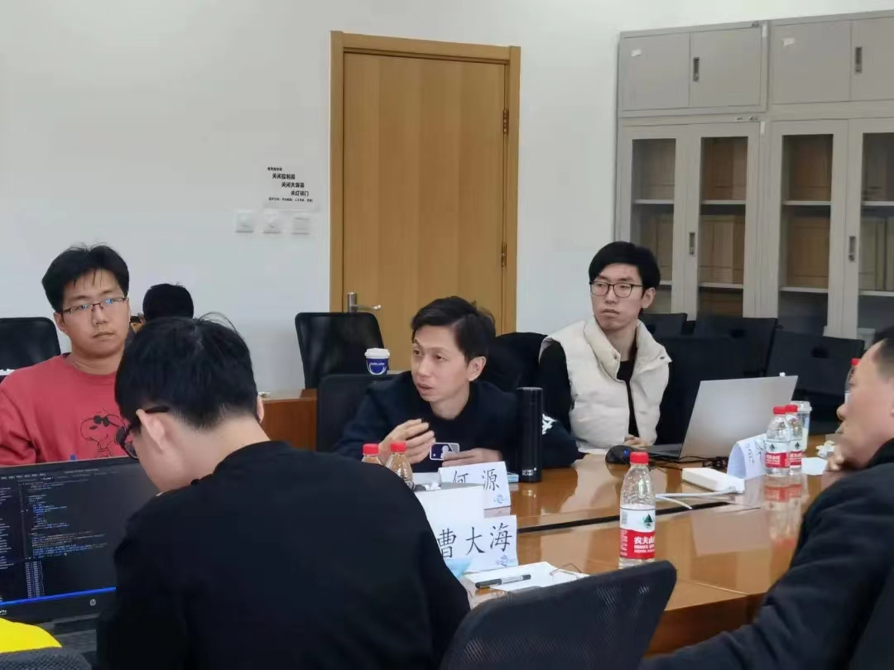{.ghost.animated.flipInX.delay-300}

<!-- ## .{.ghost.animated.fadeInUp.delay-900} -->

:::

<slide class="bg-black-blue aligncenter" image="bg1.jpg .dark.anim">

:::column {.vertical-align}
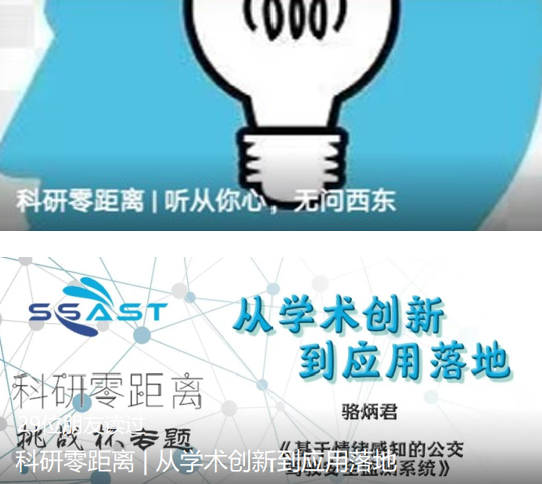{.ghost.animated.SlideInUp.delay-300}

# 科研零距离

---

#### 收集疑问，采访大佬 {.ghost.animated.fadeInUp.delay-200}

#### 撰写推送，讲述故事 {.ghost.animated.fadeInUp.delay-500}

#### 介绍经验，传递精神{.ghost.animated.fadeInUp.delay-800}

<!-- ## .{.ghost.animated.fadeInUp.delay-900} -->

:::

<slide class="bg-black-blue aligncenter" image="bg1.jpg .dark.anim">

# 收获成长

:::flexblock {.clients}

{.ghost.animated.fadeInUp.delay-300}

#### 社工能力全方位UP {.ghost.animated.fadeInUp.delay-600}

------

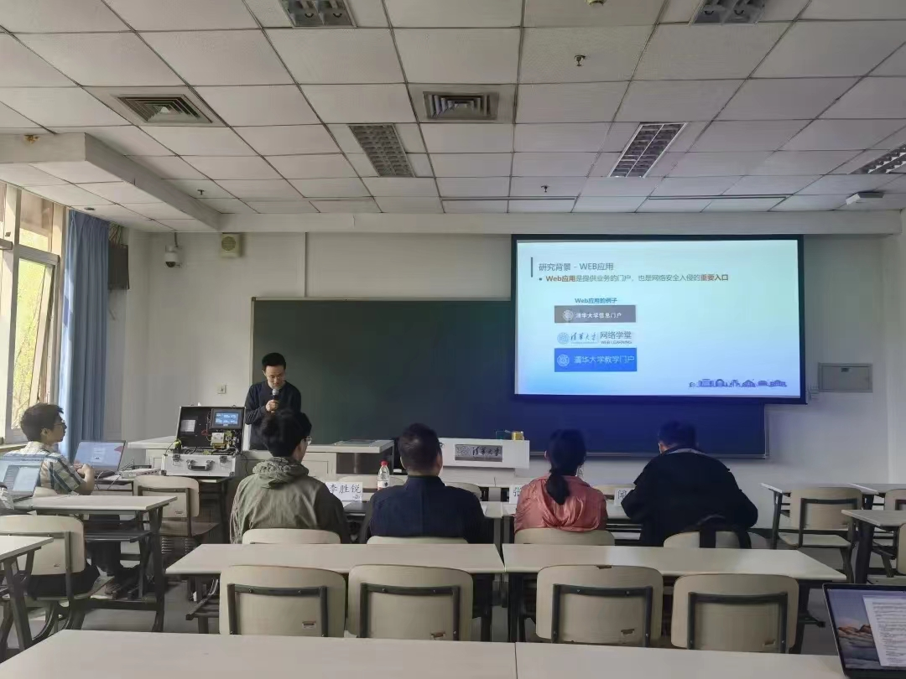{.ghost.animated.fadeInUp.delay-300}

#### 拓宽科研视野{.ghost.animated.fadeInUp.delay-600}

------

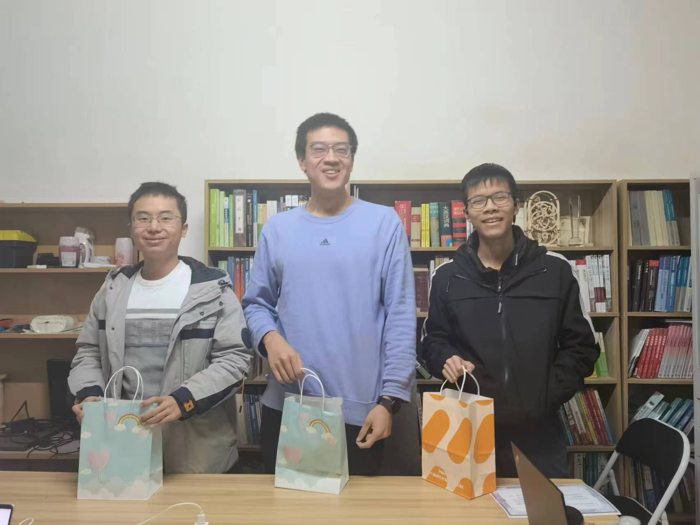{.ghost.animated.fadeInUp.delay-300}

#### 收获宝贵友谊{.ghost.animated.fadeInUp.delay-600}

<!-- ## .{.ghost.animated.fadeInUp.delay-900} -->

:::

<slide class="bg-black-blue aligncenter" image="bg1.jpg .dark.anim">

:::column {.vertical-align}

## 招收要求

---

### 对社工充满热情{.ghost.animated.fadeInUp.delay-200}

### 对科创充满兴趣{.ghost.animated.fadeInUp.delay-300}

### 能投入一定时间{.ghost.animated.fadeInUp.delay-400}

<!-- ## .{.ghost.animated.fadeInUp.delay-900} -->

<slide class="bg-black-blue aligncenter" image="bg1.jpg .dark.anim">

# 科创永无止境 · 社工始于点滴

<slide class="bg-black-blue aligncenter" image="bg1.jpg .dark.anim">

{.ghost.animated.flipInX.delay-300}

岁月伊始，佳人静候 {.text-intro.animated.fadeInUp.delay-500}

[👉点我加入软院科协大家庭](https://www.wjx.top/vm/QmaWuSS.aspx) {.text-intro.animated.fadeInUp.delay-500}

[:fa-home: Homepage](https://www.ssast.net/){.button.ghost.animated.flipInX.delay-1200}
[:fa-github: Github](https://github.com/ssast-tech){.button.ghost.animated.flipInX.delay-1200}
[:fa-child: Join Us](https://www.wjx.top/vm/QmaWuSS.aspx){.button.ghost.animated.flipInX.delay-1400}

<slide class="bg-black-blue aligncenter" image="bg1.jpg .dark.anim">

# 抽奖环节

---

